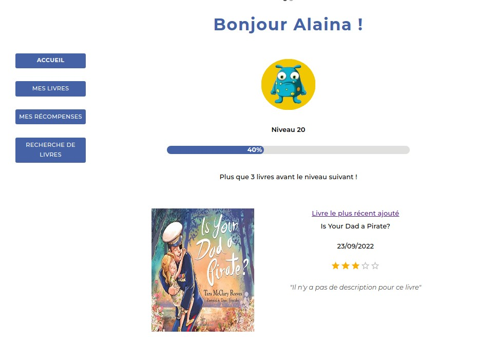
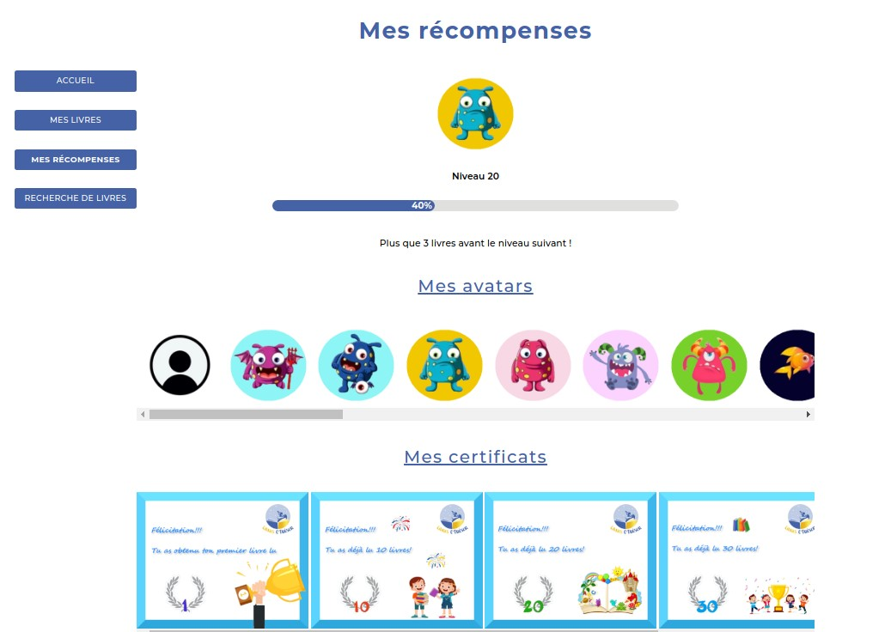
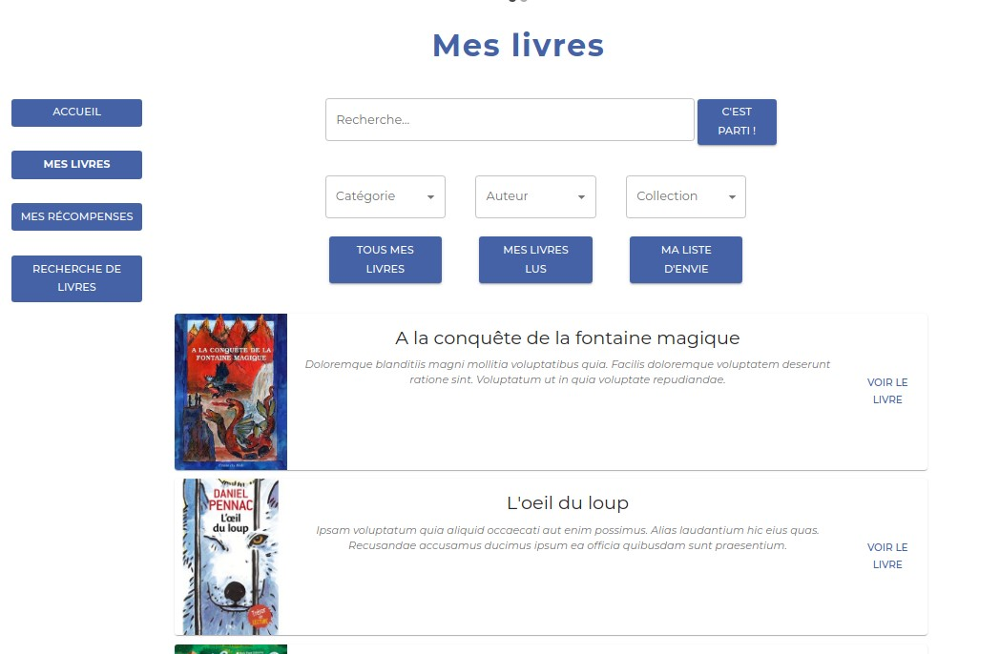

# Projet de fin de formation : Livres O'Trésor - version Front

          
      

Gestionnaire de bibliothèque pour enfant doublé d'une motivation à la lecture.  
Débuté en équipe de 5 développeurs du 9 aout au 9 septembre 2022:   
• Marie Lou Prince-Levasseur (back) 
• Tiphany Quemeneur (back) 
• Aswan Joseph-mathieu (back) 
• Cédric Cochard (front) 
• Maxime Kerkheide (front)

## Gestion des difficultés 
 • Double voie de connexion (enfant ou parent) 
 • Barre de progression 
 • Circulation des données de l'espace parent sur les espaces enfants  
 • Utilisation API externe (recherche livre) + API interne (Back API en Symfony) pour l'enregistrement et le fonctionnement

### Techniques et outils utilisés: 

Front en ReactJS 
Back en Symfony

#### Librairie et outils
 •  Webpack: 
	Webpack améliore la vitesse de chargement en regroupant tous les modules javascript  en un seul fichier. Cela permet de récupérer le script sur le serveur Web en une seule fois.  
 •  Babel: 
	React utilise la syntaxe JSX qui est plus intuitive pour le développeur mais incomprise par le navigateur.  Babel est un compilateur Javascript qui permet la traduction du JSX utilisé en une syntaxique de JavaScript interprétable par la plupart des navigateurs.	  
 •  React-redux: 
	La librairie redux ReactJS nous permet de gérer les états (states) : dès une action utilisateur les données sont réparties dans des variables prédéfinies étant accessible sur l’ensemble de l’application. Un changement dans le reducer, change le state et donc dynamise automatiquement les données affichées. 
	Plutôt que d’obtenir un changement uniquement en local, le store permettra d’utiliser un passage des données plus général et d’en modifier l’état qui se répercutera sur l’ensemble du DOM  l’utilisant. Ce store sera accessible sur l’ensemble de l’application.   
	Cette structure sera notamment très utile pour le passage des données concernant la connexion utilisateur qui gardera en mémoire les informations nécessaires sur plusieurs pages différentes. Elle sera notamment utilisée pour la mise à jour de l’avatar automatique lors du clic enfant sur une image ou encore la navigation du parent dans les espaces enfants.   
	En plus du store général, des states locaux ont été utilisés pour gérer, page par page, les informations nécessaires au bon fonctionnement de celles-ci.  

  • Redux-toolKit 
	Redux Toolkit est un ensemble d'outils qui aide à simplifier le développement de Redux . Il comprend des utilitaires pour créer et gérer des stores Redux, ainsi que pour écrire des actions et des reducers Redux.   
  • React Router Dom 
	React Router DOM permet d'implémenter un routage dynamique avec les composants.  

  • Axios 
	Axios est une librairie qui permet l'envoi de requêtes HTTP de manière asynchrone pour récupérer des données sur une source externe. Ici cela nous permettra à la fois de requêter l’API extérieure au projet, pour chercher de nouveaux livres, et de requêter notre API en back pour le retour des informations personnalisées des utilisateurs et du site dans notre base de données. L'exécution permet les opérations de type CRUD grâce aux méthode POST, GET, UPDATE, ...  
  • SCSS :  
	Permet de gérer une partie du style qui sera donné au site.  
  • MUI (material UI) 
	Permet d’obtenir rapidement des éléments prédéfinis comme  des menus déroulants et des outils de navigations. Il permet de gagner du temps pour ne pas tout créer de 0.